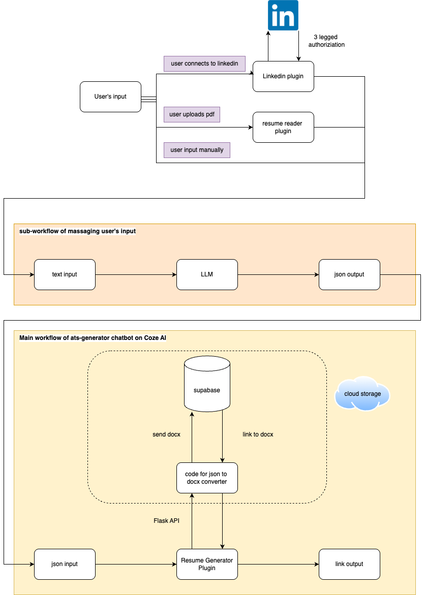

# Coze AI Chatbot for ATS-Friendly Resume Generation

## Demo
- **Demo Videos:**
  - [Manual Prompt](https://youtu.be/3-9s5kqQRYQ?si=WTaqPAAybSa6-U-u)
  - [Resume Refinement](https://youtu.be/gwf3PMt0sVY?si=DfYucVImqQ1jt2AZ)
  - [LinkedIn Data Import](https://youtu.be/_zysCtnA6aM?si=izBe0BNdR8uv2h9n)

## Project Overview
This project is an AI-powered chatbot-as-a-service that helps users generate, refine, and update resumes dynamically. Built using **Coze AI**, the chatbot follows the **low-code-no-code (LCNC) principle**, making it accessible for users with minimal coding expertise.

## Features
- **Manual Data Entry:** Users can input information without rigid predefined sections.
- **Resume Refinement:** Users can upload an existing resume (PDF) for improvement.
- **LinkedIn Integration:** Users can import profile data for streamlined resume creation.
- **ATS-Friendly Formatting:** Ensures resumes are professionally structured and optimized for applicant tracking systems.
- **Downloadable DOCX Output:** Generates resumes in a standard, editable format.

## Solution Architecture
- **Main Workflow:** Accepts user input in JSON format and generates a DOCX file.
- **Plugins:**
  - **Resume Generator:** Converts structured JSON to DOCX using Python (hosted on Render).
  - **Resume Reader:** Extracts text from uploaded resumes for refinement.
  - **LinkedIn Authorizer:** Allows users to import profile data (limited by LinkedIn's free API access).
- **Storage & API Integration:** DOCX files are stored in **Supabase**, with a downloadable link provided.
- 

## Technologies Used
- **Coze AI**: LCNC platform for chatbot development.
- **Python & Flask**: Backend for resume generation.
- **python-docx**: Library for DOCX file formatting.
- **Render**: Hosting platform for API services.
- **Supabase**: Cloud storage for DOCX files.

## Future Enhancements
- Expand **LinkedIn API** access for richer data extraction.
- Improve AI accuracy in **resume parsing & formatting**.
- Introduce **industry-specific resume templates**.
- Develop **job-matching integration** for enhanced user experience.
